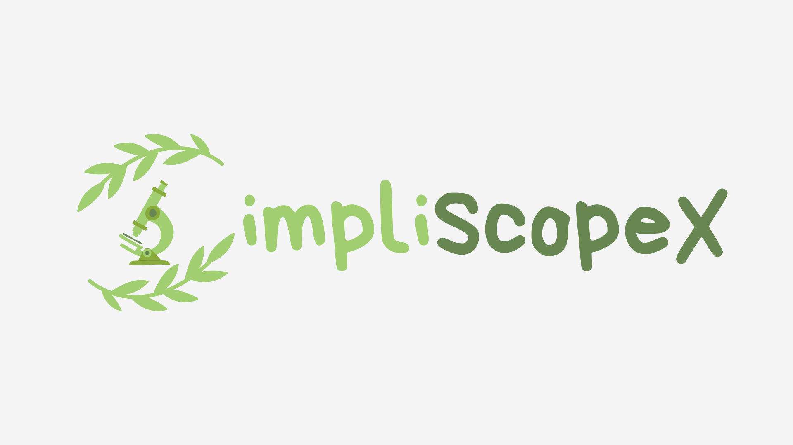

<!-- Improved compatibility of back to top link: See: https://github.com/othneildrew/Best-README-Template/pull/73 -->
<a name="readme-top"></a>
<!--
*** Thanks for checking out the Best-README-Template. If you have a suggestion
*** that would make this better, please fork the repo and create a pull request
*** or simply open an issue with the tag "enhancement".
*** Don't forget to give the project a star!
*** Thanks again! Now go create something AMAZING! :D
-->


<!-- PROJECT SHIELDS -->
<!--
*** I'm using markdown "reference style" links for readability.
*** Reference links are enclosed in brackets [ ] instead of parentheses ( ).
*** See the bottom of this document for the declaration of the reference variables
*** for contributors-url, forks-url, etc. This is an optional, concise syntax you may use.
*** https://www.markdownguide.org/basic-syntax/#reference-style-links
-->
[![Contributors][contributors-shield]][contributors-url]
[![Forks][forks-shield]][forks-url]
[![Stargazers][stars-shield]][stars-url]
[![Issues][issues-shield]][issues-url]
[![MIT License][license-shield]][license-url]
[![LinkedIn][linkedin-shield]][linkedin-url]


<!-- PROJECT LOGO -->
<br />
<div align="center">
  <a href="https://github.com/RickyIG/SimpliScopeX">
    
  </a>

<h3 align="center">SimpliScopeX</h3>

  <p align="center">
    An Improved Deep Learning Model for Microscopic Image Identification of Leaf Simplicia Fragments of Medicinal Plants
    <br />
    <a href="https://github.com/RickyIG/SimpliScopeX"><strong>Explore the docs »</strong></a>
    <br />
    <br />
    <a href="https://github.com/RickyIG/SimpliScopeX">View Demo</a>
    ·
    <a href="https://github.com/RickyIG/SimpliScopeX/issues">Report Bug</a>
    ·
    <a href="https://github.com/RickyIG/SimpliScopeX/issues">Request Feature</a>
  </p>
</div>


<!-- TABLE OF CONTENTS -->
<details>
  <summary>Table of Contents</summary>
  <ol>
    <li>
      <a href="#about-the-project">About The Project</a>
      <ul>
        <li><a href="#built-with">Built With</a></li>
      </ul>
    </li>
    <li>
      <a href="#getting-started">Getting Started</a>
      <ul>
        <li><a href="#prerequisites">Prerequisites</a></li>
        <li><a href="#installation">Installation</a></li>
      </ul>
    </li>
    <li><a href="#usage">Usage</a></li>
    <li><a href="#roadmap">Roadmap</a></li>
    <li><a href="#contributing">Contributing</a></li>
    <li><a href="#license">License</a></li>
    <li><a href="#contact">Contact</a></li>
    <li><a href="#acknowledgments">Acknowledgments</a></li>
  </ol>
</details>


<!-- ABOUT THE PROJECT -->
## About The Project



Along with the development of the "Back to Nature" trend, people are starting to turn to herbal medicine or traditional medicine derived from nature. One of the truths of dry simplicia powder of medicinal plants can be determined through a microscopic test by looking at the identification fragments. Therefore, we proposed this research as an innovative step through the application of technology to identify microscopic fragments of dried leaf simplicia and names of medicinal plant species.

<p align="right">(<a href="#readme-top">back to top</a>)</p>


### Built With

[![Python][Python]][Python-url]
[![Streamlit][Streamlit]][Streamlit-url]

<p align="right">(<a href="#readme-top">back to top</a>)</p>


<!-- GETTING STARTED -->
## Getting Started

This is an example of how you may give instructions on setting up your project locally.
To get a local copy up and running follow these simple example steps.

### Prerequisites

This is an example of how to list things you need to use the software and how to install them.
* pip
  ```sh
  pip install -r /path/to/requirements.txt
  ```

### Installation

1. Get Python 3.8.13 at [https://www.python.org/downloads/](https://www.python.org/downloads/)
2. Clone the repo
   ```sh
   git clone https://github.com/github_username/repo_name.git
   ```
3. Install Python packages
   ```sh
   pip install
   ```
4. Install the required Python packages
   ```sh
   pip install -r /path/to/requirements.txt
   ```

<p align="right">(<a href="#readme-top">back to top</a>)</p>


<!-- USAGE EXAMPLES -->
## Usage

This is an example of how to list things you need to run the software.
```sh
streamlit run main.py
```

<p align="right">(<a href="#readme-top">back to top</a>)</p>


<!-- ROADMAP -->
## Roadmap

- [x] Webapp
- [x] Quiz
- [x] Deep Learning Model

See the [open issues](https://github.com/github_username/repo_name/issues) for a full list of proposed features (and known issues).

<p align="right">(<a href="#readme-top">back to top</a>)</p>


<!-- CONTRIBUTING -->
## Contributing

Contributions are what make the open source community such an amazing place to learn, inspire, and create. Any contributions you make are **greatly appreciated**.

If you have a suggestion that would make this better, please fork the repo and create a pull request. You can also simply open an issue with the tag "enhancement".
Don't forget to give the project a star! Thanks again!

1. Fork the Project
2. Create your Feature Branch (`git checkout -b feature/AmazingFeature`)
3. Commit your Changes (`git commit -m 'Add some AmazingFeature'`)
4. Push to the Branch (`git push origin feature/AmazingFeature`)
5. Open a Pull Request

<p align="right">(<a href="#readme-top">back to top</a>)</p>


<!-- LICENSE -->
## License

Distributed under the MIT License. See `LICENSE.txt` for more information.

<p align="right">(<a href="#readme-top">back to top</a>)</p>


<!-- CONTACT -->
## Contact

Ricky Indra Gunawan - rickyindra53@gmail.com

Project Link: [https://github.com/RickyIG/SimpliScopeX](https://github.com/RickyIG/SimpliScopeX)

<p align="right">(<a href="#readme-top">back to top</a>)</p>


<!-- ACKNOWLEDGMENTS -->
## Acknowledgments

* []()
* []()
* []()

<p align="right">(<a href="#readme-top">back to top</a>)</p>


<!-- MARKDOWN LINKS & IMAGES -->
<!-- https://www.markdownguide.org/basic-syntax/#reference-style-links -->
[contributors-shield]: https://img.shields.io/github/contributors/RickyIG/SimpliScopeX.svg?style=for-the-badge
[contributors-url]: https://github.com/RickyIG/SimpliScopeX/graphs/contributors
[forks-shield]: https://img.shields.io/github/forks/RickyIG/SimpliScopeX.svg?style=for-the-badge
[forks-url]: https://github.com/RickyIG/SimpliScopeX/network/members
[stars-shield]: https://img.shields.io/github/stars/RickyIG/SimpliScopeX.svg?style=for-the-badge
[stars-url]: https://github.com/RickyIG/SimpliScopeX/stargazers
[issues-shield]: https://img.shields.io/github/issues/RickyIG/SimpliScopeX.svg?style=for-the-badge
[issues-url]: https://github.com/RickyIG/SimpliScopeX/issues
[license-shield]: https://img.shields.io/github/license/RickyIG/SimpliScopeX.svg?style=for-the-badge
[license-url]: https://github.com/RickyIG/SimpliScopeX/blob/master/LICENSE.txt
[linkedin-shield]: https://img.shields.io/badge/-LinkedIn-black.svg?style=for-the-badge&logo=linkedin&colorB=555
[linkedin-url]: https://linkedin.com/in/rickyindrag
[product-screenshot]: images/screenshot.png
[Python]: https://www.python.org/static/community_logos/python-logo.png
[Python-url]: https://python.org/
[Streamlit]: https://streamlit.io/images/brand/streamlit-logo-secondary-colormark-darktext.png
[Streamlit-url]: https://streamlit.io/
